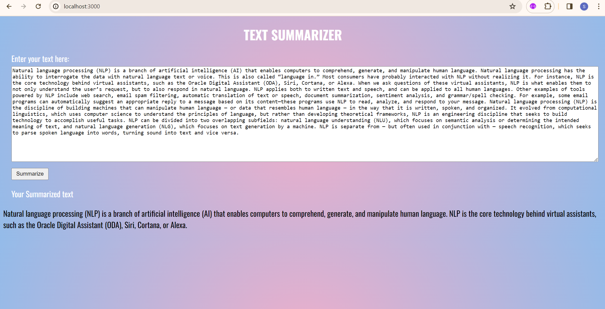

# Text Summarizer
This is a Text Summarizer application that uses BART model for summarization.
For a demo video [Click Me!!](https://youtu.be/gVOM1PlNC6U)

The Text Summarizer Application leverages the power of the BART (Bidirectional and Auto-Regressive Transformers)
model for efficient and accurate text summarization. The web-based interface offers a user-friendly environment 
for text summarization. Users can input text via a web form, providing a seamless and accessible interaction.
The application uses a NodeJs web server to handle incoming requests, passing the user's text to the BART model for summarization.
The generated summary is displayed on the webpage, providing a clear and convenient output for users.

Key Features are:

Utilizes BART, a state-of-the-art transformer model for NLP tasks.
Tokenizes and processes input text to create meaningful and context-aware summaries.
Enhances user experience with a web interface that facilitates easy text input and result visualization.

Finally, this Text Summarizer Application caters to users seeking efficient and accurate summarization of large bodies of text,
enhancing accessibility and usability through its dual interfaces.

